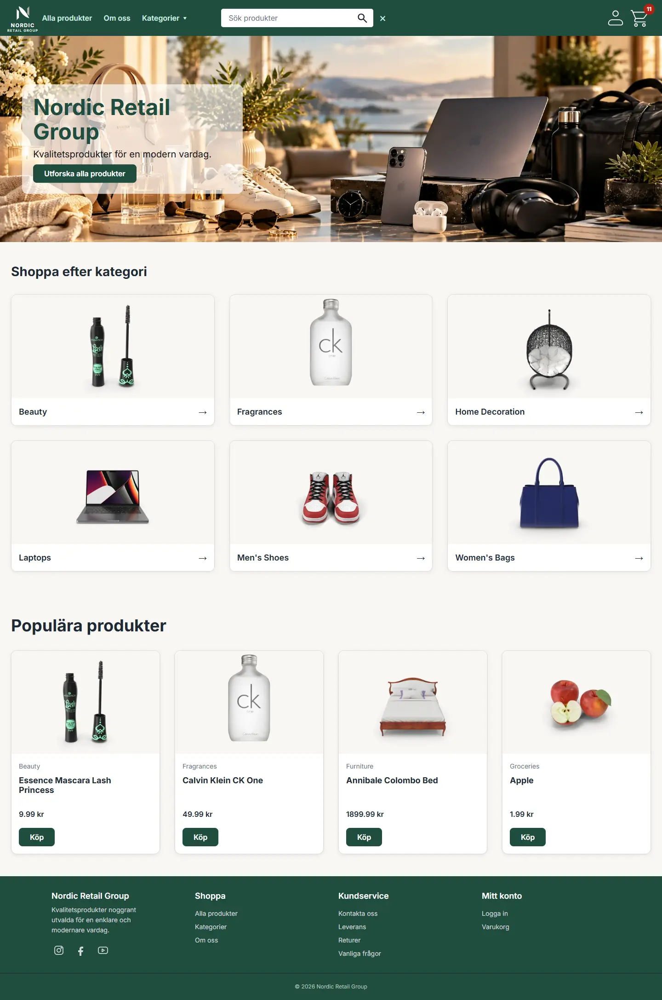
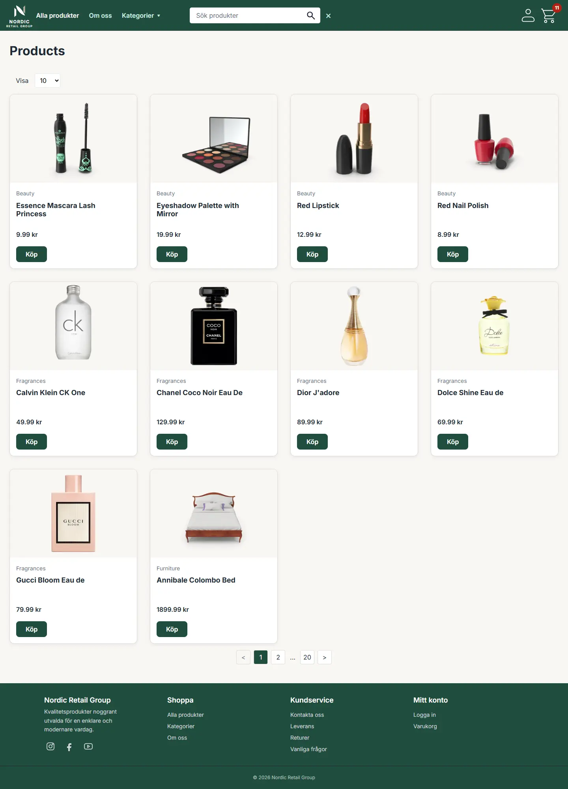
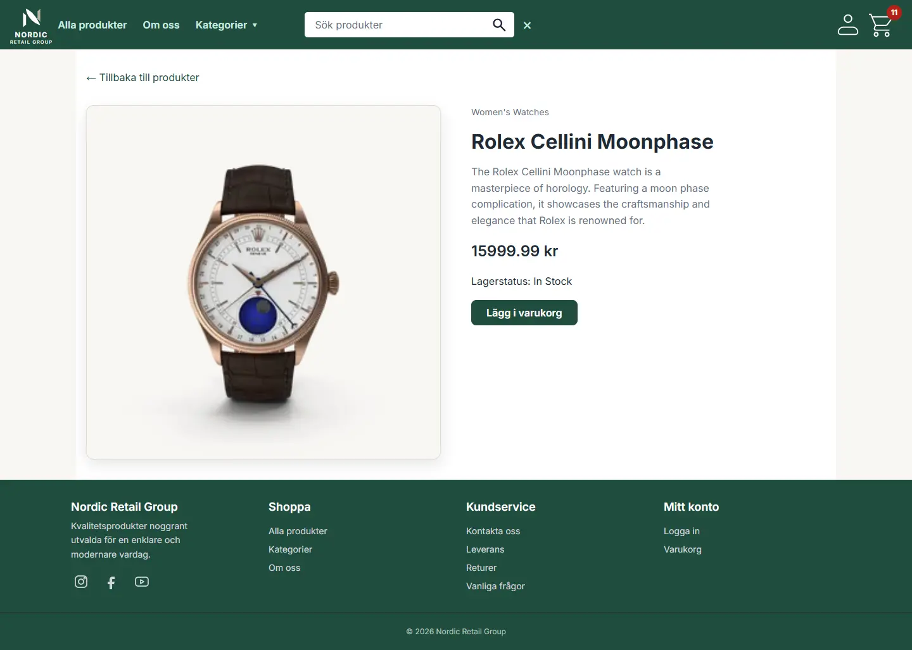
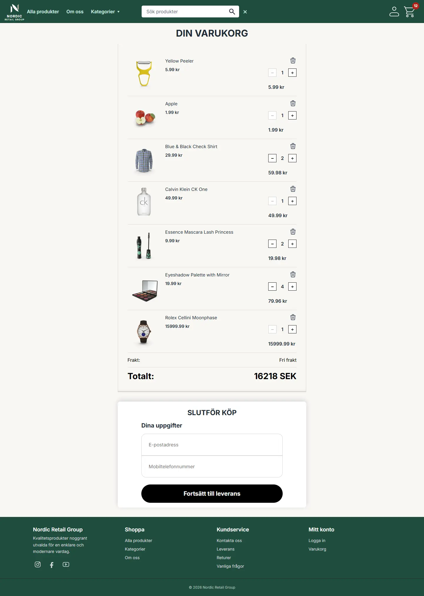
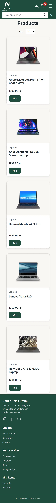

# Nordic Retail Group – Frontend

Frontend for the **Nordic Retail Group** webshop project.

The application is built with **React, TypeScript and Vite**. It communicates with an ASP.NET Core backend API and uses **Supabase** for authentication. The frontend also contains a client-side shopping cart persisted in `localStorage`.


**Live Demo:** https://nordic-retail-group-webshop.onrender.com/

**GitHub Repository:** https://github.com/perresoderberg/nordic-retail-group-webshop

## Problem

Online shoppers need a simple and reliable way to find products, compare information and manage their shopping cart. Large product catalogs can make it difficult to navigate between categories, find relevant products and keep track of selected items.

The challenge was to create a user-friendly webshop with clear navigation, responsive design and an efficient shopping experience across different devices.

## Purpose and Goals

The goal of Nordic Retail Group is to create a responsive webshop where customers can easily browse products, search and filter by category, view product details and manage their shopping cart.

The project focuses on:

- Creating a clear and intuitive user experience.
- Supporting both desktop and mobile users.
- Providing product search, category filtering and pagination.
- Keeping shopping cart data between visits using `localStorage`.
- Integrating the frontend with a backend API.
- Building a maintainable application using React and TypeScript.

## Target Audience

The webshop is designed for customers who want a simple, accessible and efficient online shopping experience.

The project is based on two primary personas defined in the PRD.

### Maya – Mobile Shopper (24)

Maya frequently shops using her smartphone and values fast loading times, clear product images and easy navigation.

She needs a responsive interface with accessible buttons, simple search functionality and a smooth experience when browsing products.

### Peter – Price- and Quality-Conscious Shopper (42)

Peter usually shops using a desktop or laptop computer. He likes to compare product information and find specific items.

He needs reliable category filtering, pagination, clear price and stock information, and shareable URLs that preserve search and filter selections.

## Screenshots

The screenshots below show the main features and responsive design of the Nordic Retail Group webshop.

### Home Page



### Product Listing



### Product Details



### Shopping Cart



### Mobile View



## Overview

The application provides:

- Product browsing
- Product search and filtering
- Product categories
- Product details
- Pagination
- Shopping cart
- Login and logout using Supabase Authentication
- Admin product management
- Inventory information and stock status
- Responsive navigation and layout
- Custom 404 page
- Client-side routing with React Router
- API communication with the ASP.NET Core backend

The frontend is deployed as a **Render Static Site** and the backend is deployed separately as an **ASP.NET Core Web Service**.

## Technology Stack

- React
- TypeScript
- Vite
- React Router
- Supabase Authentication
- CSS Modules
- Tailwind CSS utility classes
- REST/HTTP API
- `localStorage`
- ESLint
- Render

## Architecture

```text
                         ┌──────────────────────┐
                         │       Browser        │
                         │                      │
                         │   React + Vite       │
                         │   React Router       │
                         └──────────┬───────────┘
                                    │
                     ┌──────────────┴──────────────┐
                     │                             │
                     ▼                             ▼
             ┌───────────────┐             ┌───────────────┐
             │   Supabase    │             │ ASP.NET Core  │
             │               │             │    Backend    │
             │ Authentication│             │               │
             │ User roles    │             │ Products      │
             └───────────────┘             │ Categories    │
                                           │ Admin API     │
                                           └───────────────┘
```

The frontend obtains the Supabase session and the API helper adds the access token as a Bearer token when making authenticated backend requests.

## Project Structure

The source is organized mainly by feature and responsibility:

```text
src/
├── admin/
│   └── components/
│       ├── AddProductForm
│       ├── Pagination
│       ├── inventory/
│       └── products/
├── assets/
│   ├── icons/
│   └── images/
├── auth/
├── cart/
├── categories/
├── components/
├── constants/
├── home/
├── layout/
├── layouts/
├── not-found/
├── products/
├── routes/
├── services/
├── types/
├── index.css
├── main.tsx
└── router.tsx
```

### Main routes

| Route           | Purpose         |
| --------------- | --------------- |
| `/`             | Home page       |
| `/about`        | About page      |
| `/products`     | Product listing |
| `/products/:id` | Product details |
| `/basket`       | Shopping cart   |
| `/login`        | Login           |
| `/admin`        | Administration  |

The project also contains a custom `NotFoundPage` for unknown routes.

## API Communication

The shared API helper is:

```text
src/services/api.ts
```

It reads the backend URL from:

```ts
import.meta.env.VITE_API_URL;
```

Before an API request, it checks the current Supabase session. If an access token exists, it adds:

```http
Authorization: Bearer <access-token>
```

Product API functionality is located in:

```text
src/products/product-api.ts
```

Category API functionality is located in:

```text
src/categories/category-api.ts
```

## Authentication

Supabase is used for authentication.

The Supabase client is created in:

```text
src/services/supabase.ts
```

using:

```text
VITE_SUPABASE_URL
VITE_SUPABASE_PUBLISHABLE_KEY
```

Authentication operations are in:

```text
src/services/auth.ts
```

The application supports:

- Login with email and password
- Logout
- Checking the current session
- Listening for authentication state changes
- Reading the user's role
- Identifying admin users

Authentication state is exposed through React Context.

Relevant files include:

```text
src/auth/AuthContext.tsx
src/auth/AuthProvider.tsx
src/auth/useAuth.ts
```

## Shopping Cart

The shopping cart is implemented with React Context.

Important files:

```text
src/cart/CartContext.tsx
src/cart/CartProvider.tsx
src/cart/useCart.ts
src/cart/cart-service.ts
src/cart/cart-storage.ts
```

`CartProvider` owns the React cart state, while `cart-service.ts` contains the cart business logic.

Supported operations include:

- Add item
- Remove item
- Change quantity
- Clear cart
- Calculate item count
- Calculate total

`cart-storage.ts` persists the cart in `localStorage`.

The storage key is:

```text
nordic-retail-group-cart
```

Therefore the cart survives a page reload in the same browser.

## Product Listing

The product functionality supports concepts such as:

- Product search
- Category filtering
- Stock filtering
- Sorting
- Ordering
- Pagination

Product types are defined in:

```text
src/products/types.ts
```

Reusable product components include:

```text
ProductGrid
ProductCard
ProductDetails
Pagination
PageSize
```

## Admin Area

The admin area contains components for product and inventory management.

Examples include:

```text
AddProductForm
ProductFilters
ProductTable
ProductRow
SaveButton
DeleteButton
Pagination
InventoryHeader
InventoryStats
```

The admin page loads products from the backend and supports filtering, sorting and inventory-related information.

Supabase authentication and the user's role are used when determining administrative access.

## State Management

The project uses React's built-in state management mechanisms.

### `useState`

Used for local state such as:

- Form values
- Loading states
- Error messages
- Cart drawer visibility
- Product data
- Authentication state
- Admin state

### `useEffect`

Used for side effects such as:

- Loading API data
- Checking authentication sessions
- Subscribing to Supabase authentication changes
- Cleaning up subscriptions

### `useContext`

Used for shared state such as:

- Shopping cart
- Authentication

### `useSearchParams`

Used for URL-driven state such as search, filtering and pagination.

For example:

```text
/products?search=laptop&page=2
```

This makes the current filter/page state shareable through the URL and preserves it across refreshes.

## Styling

The project uses both **CSS Modules** and **Tailwind CSS utility classes**.

CSS Modules are used extensively for component-specific styling:

```text
ProductCard.tsx
ProductCard.module.css
```

Tailwind utility classes are also used for layout, spacing and some admin components.

## Accessibility

The application includes accessibility-related practices such as:

- Semantic HTML
- Labels associated with form controls
- `aria-label` for icon-only controls
- `aria-expanded` and `aria-controls` for expandable UI
- `role="status"` for loading messages
- `role="alert"` for errors
- Appropriate `alt` text for meaningful images
- Empty `alt` text for decorative images

## Environment Variables

The frontend expects:

```env
VITE_API_URL=
VITE_SUPABASE_URL=
VITE_SUPABASE_PUBLISHABLE_KEY=
```

### Local development

Use a local environment file such as:

```text
.env.local
```

Example:

```env
VITE_API_URL=https://your-backend-url
VITE_SUPABASE_URL=https://your-project.supabase.co
VITE_SUPABASE_PUBLISHABLE_KEY=sb_publishable_...
```

Do **not** commit `.env.local`.

A safe template can be committed as:

```text
.env.example
```

with empty values:

```env
VITE_API_URL=
VITE_SUPABASE_URL=
VITE_SUPABASE_PUBLISHABLE_KEY=
```

### Production

Production values should be configured in the hosting platform.

For the Render Static Site, configure:

```text
VITE_API_URL
VITE_SUPABASE_URL
VITE_SUPABASE_PUBLISHABLE_KEY
```

The Supabase publishable key is intended for the browser application. A Supabase secret/service-role key must never be placed in a `VITE_*` variable.

## Running Locally

Install dependencies:

```bash
npm install
```

Start the development server:

```bash
npm run dev
```

Create a production build:

```bash
npm run build
```

The build output is generated in:

```text
dist/
```

Preview the production build:

```bash
npm run preview
```

`npm run preview` serves the already-built `dist` directory. After changing source files or assets, rebuild before previewing:

```bash
npm run build
npm run preview
```

## Deployment to Render

The frontend is deployed as a **Static Site** on Render.

Recommended settings:

```text
Build Command:
npm run build

Publish Directory:
dist
```

The backend is deployed separately as an ASP.NET Core Web Service. Both services can belong to the same Render Project while remaining independently deployable.

### React Router rewrite

Because the application uses `createBrowserRouter`, the Render Static Site needs an SPA rewrite so that direct navigation to client-side routes works.

Configure:

```text
Source:      /*
Destination: /index.html
Action:      Rewrite
```

For example, a direct request to:

```text
/products
```

must first receive `index.html` from Render. React Router can then handle `/products` in the browser.

Without the rewrite, Render may return a server-side 404 before React starts.

## Production Flow

```text
GitHub
   │
   ▼
Render Static Site
   │
   ├── npm run build
   │
   ▼
dist/
   │
   ▼
Browser
   │
   ├── Supabase Authentication
   │
   └── ASP.NET Core Backend
```

## Important Files

| File                          | Responsibility                           |
| ----------------------------- | ---------------------------------------- |
| `src/main.tsx`                | React entry point                        |
| `src/router.tsx`              | Application routing                      |
| `src/layouts/MainLayout.tsx`  | Shared page layout                       |
| `src/services/api.ts`         | Backend communication and token handling |
| `src/services/supabase.ts`    | Supabase client                          |
| `src/services/auth.ts`        | Authentication operations                |
| `src/auth/AuthProvider.tsx`   | Authentication state                     |
| `src/cart/CartProvider.tsx`   | Shared cart state                        |
| `src/cart/cart-service.ts`    | Cart business logic                      |
| `src/cart/cart-storage.ts`    | Cart persistence                         |
| `src/products/product-api.ts` | Product API operations                   |
| `src/products/types.ts`       | Product TypeScript types                 |
| `vite.config.ts`              | Vite configuration                       |

## Development Notes

### URL-driven filters

Search, filtering and pagination use query parameters where appropriate.

For example:

```text
/products?search=phone&categoryId=4&page=2
```

Using the URL for this state means that:

- The current view can be refreshed without losing the filter.
- A filtered page can be shared.
- Browser navigation can preserve the current state.

### Separation of responsibilities

The project separates:

- Routes/pages
- Reusable UI components
- API communication
- Authentication
- Cart state
- Cart persistence
- Types
- Styling

This makes individual parts easier to understand and maintain.

## Known Limitations / Future Improvements

The current frontend is a school/project webshop implementation rather than a complete production e-commerce platform.

Possible future improvements include:

- Complete checkout flow
- Real payment integration
- Order management
- Persistent server-side shopping carts
- More complete product editing
- More comprehensive error boundaries
- Automated tests
- More extensive accessibility testing
- Improved loading skeletons
- More detailed API error handling
- Better handling of expired authentication sessions
- Additional customer-account functionality

## Commands

```bash
npm install
npm run dev
npm run build
npm run preview
```

## Related Documentation

The repository also contains:

```text
PRD.md
kontrakt.md

docs/
├── ADR-001.md
└── GLOSSARY.md
```

These documents contain additional project requirements, architectural decisions, terminology and project-specific agreements.
